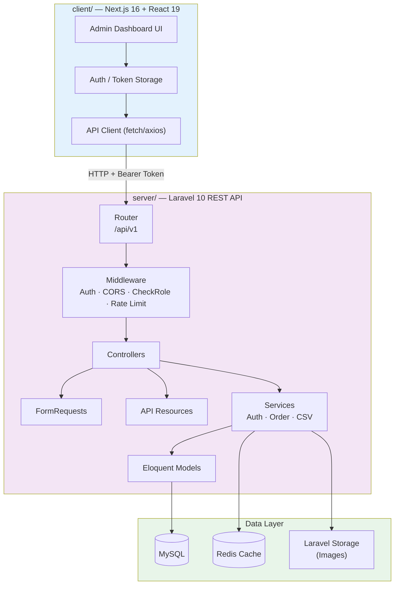
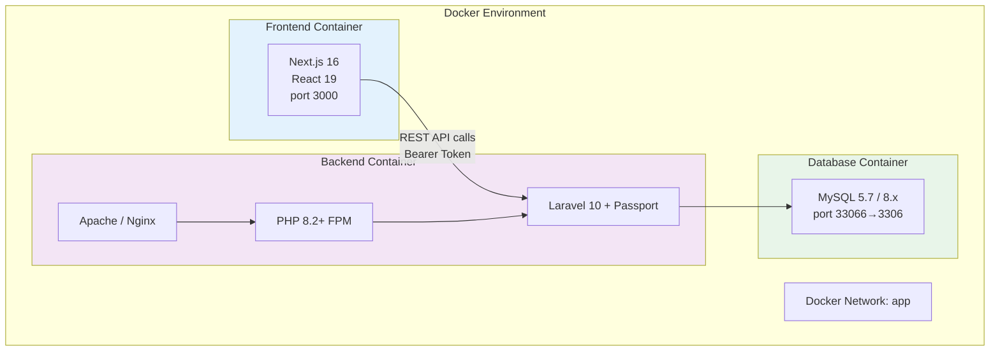
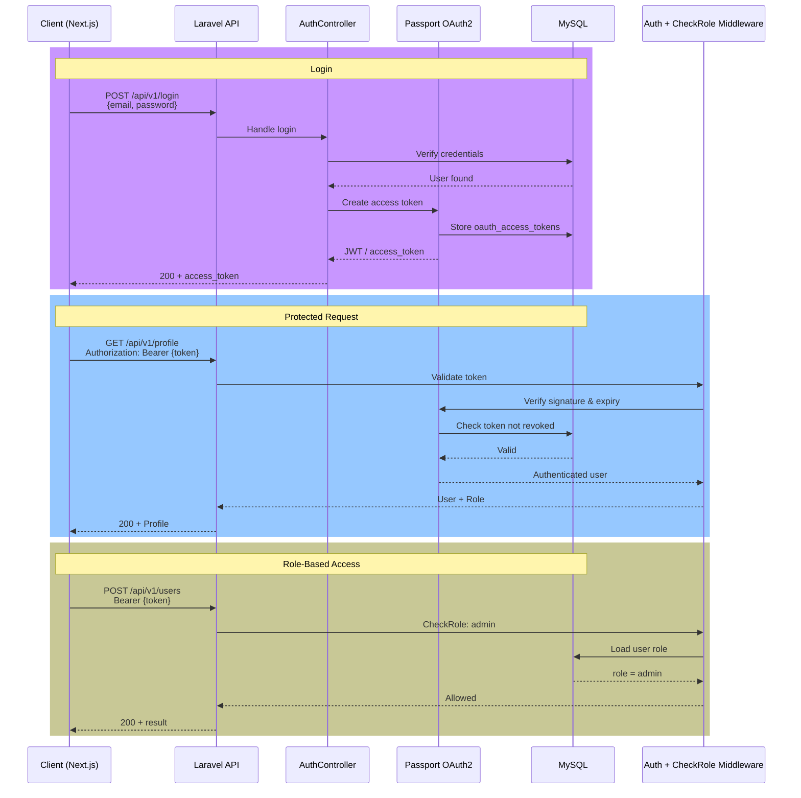
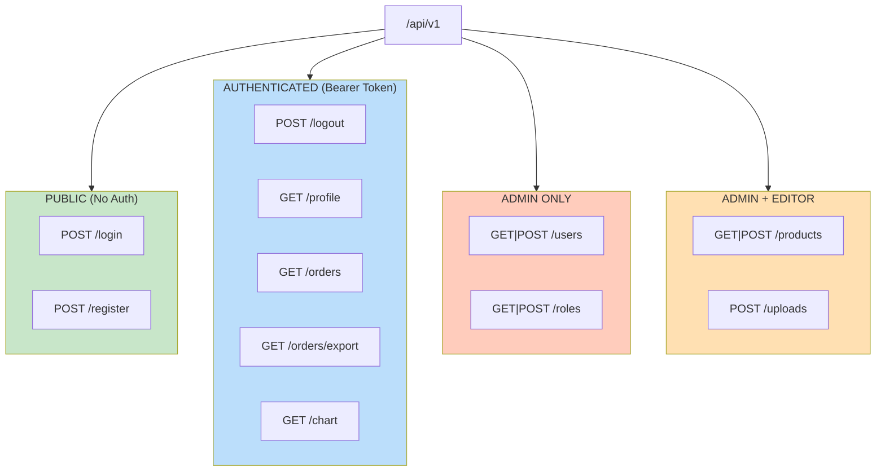
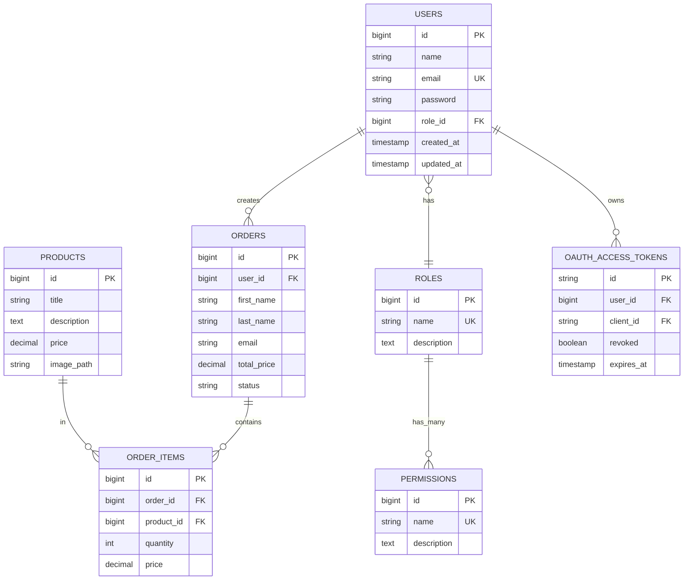

# Laravel + React REST API (Decoupled Architecture)

A fully **decoupled** full-stack admin application:

- **`server/`** — Production-ready Laravel REST API (Passport auth, RBAC, products, orders)
- **`client/`** — Next.js (React) admin dashboard

Each side runs independently with its own Docker setup and can be developed, deployed, and scaled separately.

[](https://laravel.com)
[](https://nextjs.org)
[](https://react.dev)
[](https://docker.com)
[](server/LICENSE.md)

---

## Architecture Overview



### Why Decoupled?

| Benefit              | Description                                      |
|----------------------|--------------------------------------------------|
| Independent deploy   | Frontend & backend can be released separately    |
| Tech flexibility     | Swap React/Next.js or Laravel without rewriting  |
| Parallel development | Frontend & backend teams work in isolation       |
| Scalability          | Scale API and UI independently                   |
| Clear contracts      | API is the single source of truth                |

---

## Docker Architecture



---

## Project Structure

```
laravel-react-rest-api/
├── client/                 # Next.js admin dashboard
│   ├── app/                # App Router pages & layouts
│   ├── public/
│   ├── package.json
│   ├── next.config.ts
│   └── README.md
│
└── server/                 # Laravel REST API
    ├── app/
    │   ├── Http/
    │   │   ├── Controllers/
    │   │   ├── Middleware/     # CheckRole, etc.
    │   │   ├── Requests/       # FormRequest validation
    │   │   └── Resources/      # API transformers
    │   ├── Models/
    │   └── Services/
    ├── routes/api.php          # /api/v1/*
    ├── Dockerfile
    ├── docker-compose.yaml
    └── README.md
```

---

## Features

### Backend (`server/`)

- **JWT authentication** via Laravel Passport (OAuth2)
- **Role-based access control** — `admin` / `editor` + permissions
- **User management** — CRUD, profile, password change
- **Product management** — full CRUD + image upload (Laravel Storage)
- **Order management** — list, show, streaming CSV export
- **API versioning** — all routes under `/api/v1`
- **FormRequest validation** + **API Resources** (no raw model leakage)
- **Swagger / OpenAPI** documentation (l5-swagger)
- Docker-ready (PHP-FPM + Apache + MySQL)

### Frontend (`client/`)

- **Next.js 16** (App Router) + **React 19**
- **TypeScript** + **Tailwind CSS 4**
- Modern UI components (shadcn/ui style)
- Bun as package manager (also works with npm/yarn/pnpm)

---

## Authentication & Authorization Flow



---

## API Route Hierarchy & Access Control



---

## Database Schema



---

## Quick Start

### Prerequisites

- Docker & Docker Compose (recommended)
- **or**
    - PHP 8.2+, Composer, MySQL 8
    - Node.js 20+ (or Bun)

### 1. Clone the repository

```bash
git clone https://github.com/Ahmed-Hamdy101/laravel-react-rest-api.git
cd laravel-react-rest-api
git checkout decouple-architecture
```

### 2. Start the Backend (Laravel API)

```bash
cd server
cp .env.example .env
docker compose up --build -d

# Inside the container (or locally):
php artisan key:generate
php artisan migrate
php artisan passport:install
php artisan storage:link
```

API available at: `http://localhost:8000/api/v1`

### 3. Start the Frontend (Next.js)

```bash
cd client
bun install          # or: npm install
bun dev              # or: npm run dev
```

Dashboard available at: `http://localhost:3000`

> Set `NEXT_PUBLIC_API_URL=http://localhost:8000/api/v1` in `client/.env.local`.

---

## API Reference

Protected routes require:

```
Authorization: Bearer <access_token>
```

| Method | Endpoint                | Auth | Role          | Description           |
|--------|-------------------------|------|---------------|-----------------------|
| POST   | `/api/v1/login`         | —    | —             | Login → returns token |
| POST   | `/api/v1/register`      | —    | —             | Register new user     |
| POST   | `/api/v1/logout`        | ✅   | —             | Revoke current token  |
| GET    | `/api/v1/profile`       | ✅   | —             | Current user profile  |
| GET    | `/api/v1/users`         | ✅   | admin         | List users            |
| POST   | `/api/v1/users`         | ✅   | admin         | Create user           |
| GET    | `/api/v1/products`      | ✅   | admin\|editor | List products         |
| POST   | `/api/v1/products`      | ✅   | admin\|editor | Create product        |
| GET    | `/api/v1/orders`        | ✅   | —             | List orders           |
| GET    | `/api/v1/orders/export` | ✅   | —             | Stream CSV export     |
| POST   | `/api/v1/uploads`       | ✅   | admin\|editor | Upload image          |

Full docs & Swagger: see `server/README.md` and `/api/documentation`.

---

## Tech Stack

| Layer     | Technology                                      |
|-----------|-------------------------------------------------|
| Frontend  | Next.js 16, React 19, TypeScript, Tailwind CSS 4, Bun |
| Backend   | Laravel 10, PHP 8.2+, Passport, Spatie Permission |
| Database  | MySQL 5.7 / 8.x                                 |
| Auth      | Laravel Passport (OAuth2 / JWT)                 |
| Docs      | l5-swagger (OpenAPI)                            |
| Container | Docker + Docker Compose                         |

---

## Development Tips

- **CORS** — Match `FRONTEND_URL` / allowed origins in Laravel with your client URL.
- **Token storage** — Store the Passport access token securely (httpOnly cookie or secure storage).
- **API contract** — Treat `/api/v1` as the contract between `client` and `server`.
- **Environment** — Never commit real `.env` files. Use `.env.example` as the template.

---

## Documentation

- Backend deep-dive: [`server/README.md`](server/README.md)
- Architecture diagrams: [`server/docs/`](server/docs/)
- Client getting started: [`client/README.md`](client/README.md)

---

## License

MIT — see [`server/LICENSE.md`](server/LICENSE.md)

---

⭐ **Star this repo if you find it useful!**

